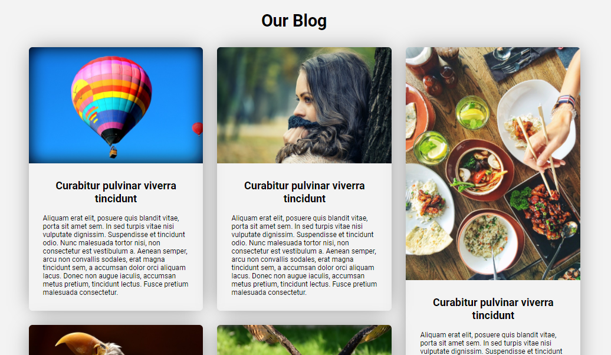
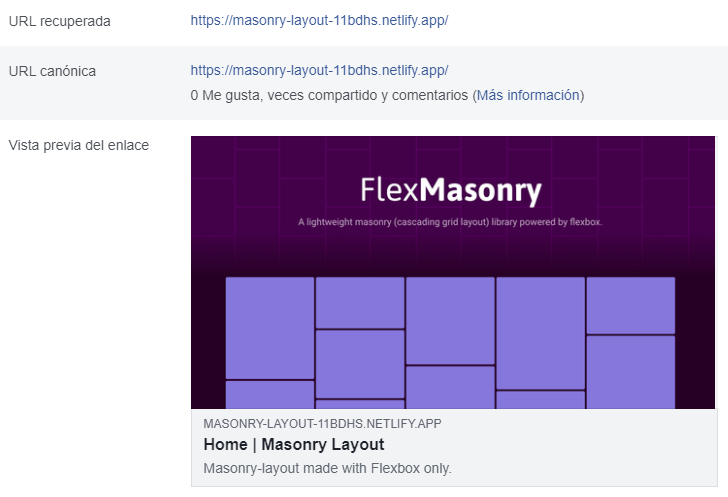
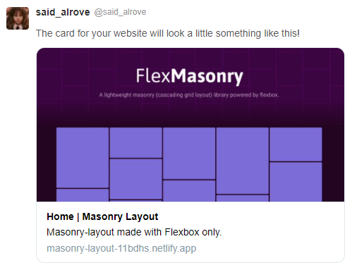

# [masonry-layout](https://masonry-layout-11bdhs.netlify.app/)
This is the fifth project from Juan Pablo's course of [CSS Grid and Flexbox](https://www.udemy.com/course/css-grid-y-flexbox-la-guia-definitiva-crea-10-proyectos/).

> **Note:** this was an easy project for practicing with the Masonry-layout that's well known because is the layout Pinterest uses in their application to show the image results... something to remark is that this design isn't totally possible with CSS only (in this case Flexbox gave me a hand, but there's a huge problem though because you have to hit the height of the main-container to get the wished result by testing and if you add more elements you'll have to test another height that might fit with it), but in the future Grid could be the solution to this (with the **grid-template-rows** property set to **masonry**), but because there's still a few issues with that implementation, today the best option is directly with Javascript.

> **Disclaimer:** I'm starting to learn how to use **Git/Github** correctly, therefore there'll be plenty of pull requests, commits and other stuff as tests in this repository, however, *this won't represent my way of working forever*, I'll learn more things along the way as always :D!.

## Table of contents
* [Preview](#preview)
* [What I learned](#what-i-learned)
* [Open Graph](#open-graph)
    - [Facebook](#facebook)
    - [Twitter](#twitter)

## What I learned
This time I didn't have too much opportunity to learn new things because of the low complexity of the project, but in the next one, I have planned to start learning [Tailwind CSS](https://tailwindcss.com/) and implement it in projects that are left from this course.

## Preview

## Open Graph

### Facebook

### Twitter
